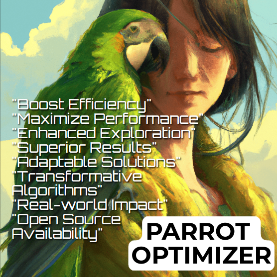

# Parrot Optimizer: Algorithm and Applications to Medical Problems

Version 2, uploaded on April 4th, 2024, has addressed all known bugs. Please ensure that you are using the latest version.

## Introduction

Welcome to the Parrot Optimizer repository! The Parrot Optimizer (PO) is an innovative optimization algorithm inspired by the behaviors of trained Pyrrhura Molinae parrots. This repository contains the source code for the PO, along with comprehensive documentation to help you understand and utilize this powerful optimization tool.

  
  
  

## Overview

This repository houses the implementation of the PO algorithm, introduced and detailed in the research paper titled "Parrot optimizer: Algorithm and applications to medical problems." The paper, authored by Junbo Lian, Guohua Hui, Ling Ma, Ting Zhu, Xincan Wu, Ali Asghar Heidari, Yi Chen, and Huiling Chen, was published in Computers in Biology and Medicine in 2024.

1. **Parameter Inputs:**
   - `N`: Number of individuals in the population.
   - `Max_iter`: Maximum number of iterations.
   - `lb` and `ub`: Lower and upper bounds for the optimization variables.
   - `dim`: Dimensionality of the problem.
   - `fobj`: Objective function to be minimized.

2. **Initialization:**
   - The optimization process begins with the initialization of the population.

3. **Foraging Behaviors:**
   - The algorithm incorporates different foraging behaviors including searching, staying, communicating, and fear of strangers.

4. **Levy Flight Strategy:**
   - The Levy flight strategy is employed for exploration, enhancing the global search capability.

5. **Boundary Control:**
   - The algorithm ensures that individuals stay within the specified search space boundaries.

6. **Sorting and Updating:**
   - Individuals are sorted based on their fitness values, and the global best solution is updated accordingly.

7. **Levy Search Strategy:**
   - A Levy search strategy is used to balance exploration and exploitation.

8. **Fitness Tracking:**
   - Fitness values and positions are tracked throughout the optimization process.

### Usage Example:

[N, Max_iter, lb, ub, dim, fobj] = set_your_parameters();
[avg_fitness_curve, Best_pos, Best_score, curve, search_history, fitness_history] = PO(N, Max_iter, lb, ub, dim, fobj); 

**Note:**
Please replace set_your_parameters() with appropriate parameter values based on your optimization problem.

Ensure that the objective function (fobj) is defined according to your optimization task.

Feel free to explore and utilize the Parrot Optimizer for your optimization needs. If you have any questions or feedback, please reach out to the authors.

Thank you for your interest in the Parrot Optimizer!

## Key Features

- Efficient optimization inspired by parrot behaviors.
- Qualitative analysis and experiments on 35 functions.
- Benchmarking against popular algorithms.
- Adaptability demonstrated in engineering design, disease diagnosis, and medical image segmentation.

# Applications

Explore the applications of the Parrot Optimizer in medical image segmentation:

- [Multi-Threshold Image Segmentation (MTIS)](applications.md#multi-threshold-image-segmentation-mtis)
  - Learn about our approach combining non-local mean filtering, 2D histograms, Kapur entropy, and the Parrot Optimizer for enhanced segmentation of histopathology microscopy images.

For detailed experiments, evaluation metrics, and results, refer to the [Applications.md](applications.md) file.

## Comparing Parrot-optimizer (PO) with State-of-the-art Algorithms

To compare the performance of the Parrot-optimizer with other optimization algorithms provided in this repository, follow these steps:

1. Download the zip files containing the other optimization algorithms from the repository:
  - [Compare Parrot optimizer with Artemisinin Optimization (AO).zip](https://github.com/aliasgharheidaricom/Parrot-optimizer-Algorithm-and-applications-to-medical-problems/blob/main/Compare%20Parrot%20Optimizer%20with%20Artemisinin%20Optimization%20(AO).zip)
   - [Compare Parrot optimizer with Harris Hawk Optimizer (HHO).zip](https://github.com/aliasgharheidaricom/Parrot-optimizer-Algorithm-and-applications-to-medical-problems/blob/main/Compare%20Parrot%20Optimizer%20with%20Harris%20Hawk%20Optimizer%20(HHO).zip)
   - [Compare Parrot optimizer with Hunger games search (HGS).zip](https://github.com/aliasgharheidaricom/Parrot-optimizer-Algorithm-and-applications-to-medical-problems/blob/main/Compare%20Parrot%20Optimizer%20with%20Hunger%20games%20search%20(HGS).zip)
   - [Compare Parrot optimizer with RIME optimizer.zip](https://github.com/aliasgharheidaricom/Parrot-optimizer-Algorithm-and-applications-to-medical-problems/blob/main/Compare%20Parrot%20Optimizer%20with%20RIME%20optimizer.zip)
   - [Compare Parrot optimizer with Runge Kutta Optimization (RUN).zip](https://github.com/aliasgharheidaricom/Parrot-optimizer-Algorithm-and-applications-to-medical-problems/blob/main/Compare%20Parrot%20Optimizer%20with%20Runge%20Kutta%20Optimization%20(RUN).zip)
   - [Compare Parrot optimizer with Slime mould algorithm (SMA).zip](https://github.com/aliasgharheidaricom/Parrot-optimizer-Algorithm-and-applications-to-medical-problems/blob/main/Compare%20Parrot%20Optimizer%20with%20Slime%20mould%20algorithm%20(SMA).zip)
   - [Compare Parrot optimizer with Weighted Mean of Vectors (INFO) optimizer.zip](https://github.com/aliasgharheidaricom/Parrot-optimizer-Algorithm-and-applications-to-medical-problems/blob/main/Compare%20Parrot%20Optimizer%20with%20Weighted%20Mean%20of%20Vectors%20(INFO)%20optimizer.zip)

3. Extract the contents of each zip file to your local machine.

4. Run each optimization algorithm using the provided code or executable files.

5. Evaluate and compare the performance of each algorithm based on predefined metrics or criteria.

6. Share your findings and insights with the community by contributing to the respective repositories or sharing your analysis in academic papers or forums.

Feel free to explore and analyze the performance of theParrot optimizer compared to other state-of-the-art optimization algorithms. If you have any questions or need assistance, don't hesitate to reach out to the authors or the respective communities of each optimization algorithm.

## Contributing

We welcome contributions from the community! If you'd like to contribute to the Parrot Optimizer project, please contact us
If you have any questions, suggestions, or feedback, feel free to reach out to the authors:

- **Junbo Lian**
  - Email: [junbolian@qq.com](mailto:junbolian@qq.com)

- **Ali Asghar Heidari**
  - Email: [as_heidari@ut.ac.ir](mailto:as_heidari@ut.ac.ir), [aliasghar68@gmail.com](mailto:aliasghar68@gmail.com)

- **Huiling Chen**
  - Email: [chenhuiling.jlu@gmail.com](mailto:chenhuiling.jlu@gmail.com)

## Acknowledgments

We extend our gratitude to all contributors and organizations that supported the development of the Parrot Optimizer. 

## License

The Parrot Optimizer is licensed under the [MIT License](LICENSE). Please review the license for details on how you can use and distribute this software.

## Contact Information

If you have any questions, feedback, or collaboration inquiries, feel free to reach out to us

- **Junbo Lian**
  - Email: [junbolian@qq.com](mailto:junbolian@qq.com)

- **Ali Asghar Heidari**
  - Email: [as_heidari@ut.ac.ir](mailto:as_heidari@ut.ac.ir), [aliasghar68@gmail.com](mailto:aliasghar68@gmail.com)

- **Huiling Chen**
  - Email: [chenhuiling.jlu@gmail.com](mailto:chenhuiling.jlu@gmail.com)

## Citation

If you use the Parrot Optimizer in your academic research, please cite our paper. 
Junbo Lian, Guohua Hui, Ling Ma, Ting Zhu, Xincan Wu, Ali Asghar Heidari, Yi Chen, Huiling Chen,
Parrot optimizer: Algorithm and applications to medical problems,
Computers in Biology and Medicine,
2024,
108064,
ISSN 0010-4825,
https://doi.org/10.1016/j.compbiomed.2024.108064.
(https://www.sciencedirect.com/science/article/pii/S0010482524001483)

## Supplementary Files and Code

For additional resources, supplementary files, and open-source code, visit [aliasgharheidari.com/PO.html](https://aliasgharheidari.com/PO.html).

## MATLAB File Exchange

Find the Parrot Optimizer on MathWorks File Exchange: [Parrot Optimizer - Algorithm and Application to Medical Problem](https://ch.mathworks.com/matlabcentral/fileexchange/158681-parrot-optimizer-algorithm-application-to-medical-problem)

## Flowchart

.png)

Feel free to explore the code, contribute to the project, and leverage the Parrot Optimizer for your optimization needs. Thank you for your interest in the Parrot Optimizer!
